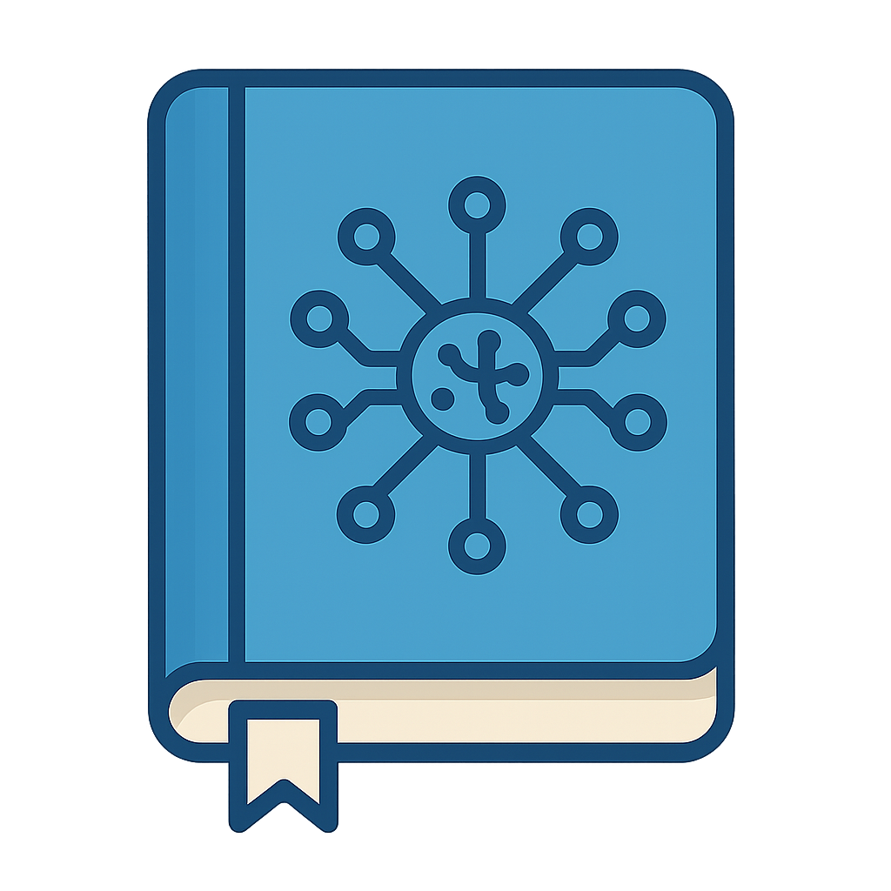

<p align="center">
  
</p>

<h1 align="center">JournIA</h1>
<p align="center">
  AI-assisted journaling with emotion analysis, visuals, and manual mood tracking.
</p>

---

## Overview

JournIA is a full-stack app that helps you journal and visualize your mood data.

- **Journal**: free-form entries with AI integration.
- **Graphs**: interactive dashboards for the analyses.
- **Manual Metrics**: add your own activities, spider quiz ratings, and Plutchik emotions.
- **Past Entries**: review previous conversations and their analysis.
- **Notes**: a simple notes area.
- **Settings**: configure your preferences.

### What you’ll see when you run it

1. **Home** → enter *age* and *gender* (used by analysis).
2. **Dashboard** → the hub. From here you can jump to:
   - **Journal** (write a new entry -> run AI analysis),
   - **Graphs** (visualize analyses; can filter by day/week/month or by entry),
   - **Past Entries** (open a specific conversation to see its metrics),
   - **Add Metrics** (manually add mood/quiz/emotions),
   - **Notes** and **Settings**.

---

## Requirements

- **Python**: 3.11 (3.11.9 recommended if using GPU llama-cpp-python build)
- **Node.js**: ≥ 18 LTS recommended
- **npm**: ≥ 9
- (Optional) **CUDA**: recent version if you plan to run `llama-cpp-python` with GPU
- (Apple Silicon) **Homebrew** with `cmake` and `pkg-config`

---

## Installation
Create & activate a virtual environment from inside JournAI/ (recommended):

```bash
# macOS / Linux
python3.11 -m venv .venv
source .venv/bin/activate

# Windows
py -3.11 -m venv venv
.\venv\Scripts\activate
```
### Run following commands to install  dependencies: 
#### Backend:
- `pip install -r requirements.txt`
- `$env:CMAKE_ARGS="-DGGML_CUDA=on"; pip install --force-reinstall --no-cache-dir llama-cpp-python` —> to use GPU (standard llama-cpp-python is for cpu only. For this one we need python version 3.11.9 and a recent version of CUDA)
- `brew install cmake` —> for Apple M1 hardware
- `brew install pkg-config` —> for Apple M1 hardware

#### Frontend:
- `npm install`


## Running the app
- Inside backend run: `uvicorn main:app --reload` to start the server
- Inside frontend run: `ng serve` to start the web cli
